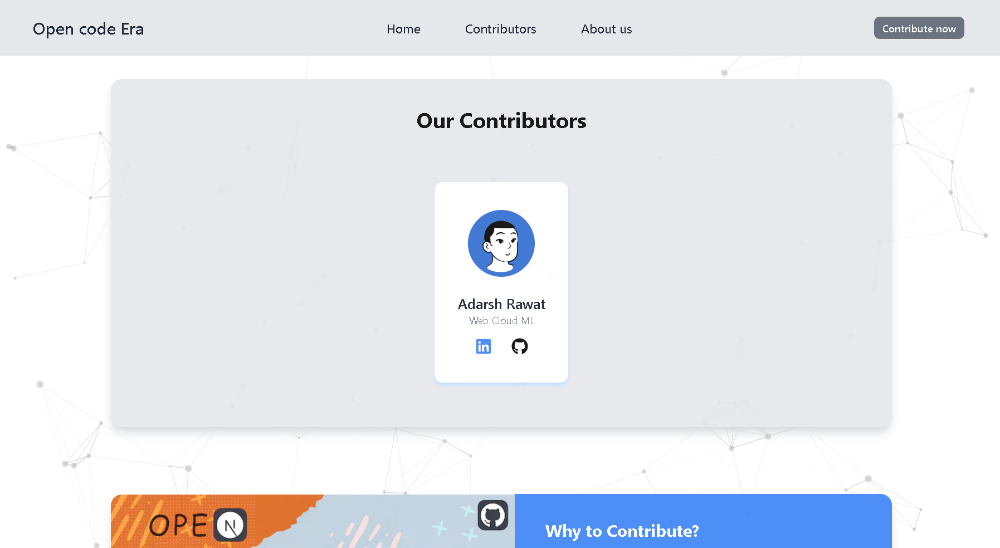

<h1 align='center'>Learn . Contribute . Grow</h1>

----

#### Tips for Contributors:

- PRs beyond our open issues are welcome but make sure your contributions are meaningful and beneficial to other users otherwise your PR may be closed and marked as ‘invalid’.
- Issues before PRs. If you plan to make a contribution, please make sure there is an issue for it. You can either find an existing issue or open a new issue if none exists.
- You are welcome to make your first contribution to this repo. Go through with [CONTRIBUTING.md](/CONTRIBUTING.md) file.
- Hactoberfest repos will be added soon 

## What would you have to do? 🤔

+ [This](https://opencodeera-first-contribution.vercel.app/) is the website we have created for our first contributors, you will see a few cards with some details of the contributor.

+ Now, to get your contributor card, you have to contribute to this repository, following our guidelines.

## How to contribute? 🧐

We recommend you to go through the [CONTRIBUTING.md](https://github.com/Clueless-Community/first-contribution/blob/main/CONTRIBUTING.md) file, where we have guided you step by step to make your contribution.

Once the pull request is merged, you will find your awesome contribution card on our website.

## Thanks to all the contributors ❤️

<!-- Made with [contrib.rocks](https://contrib.rocks). -->
